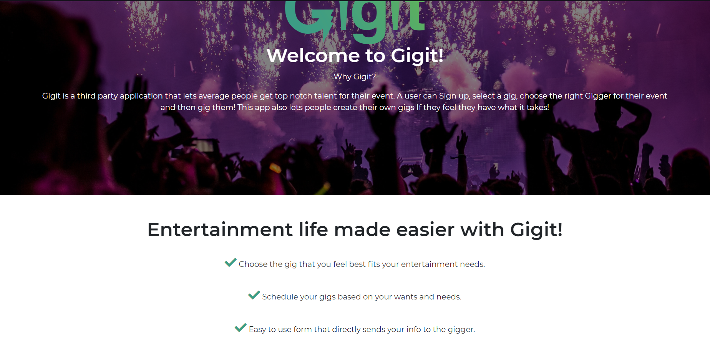
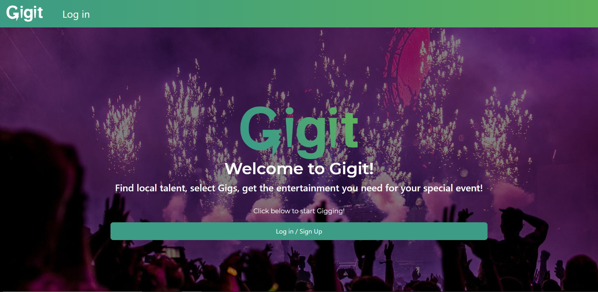
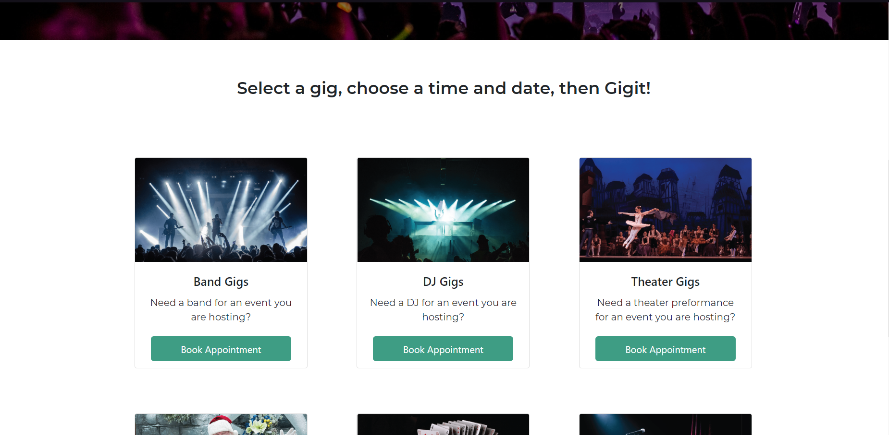
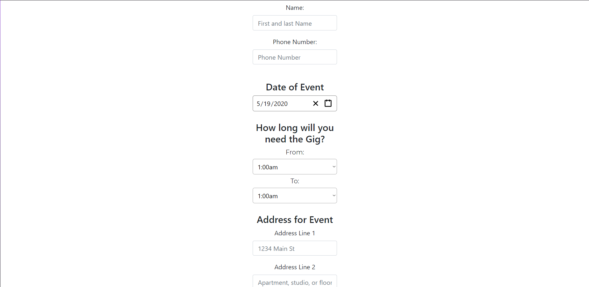
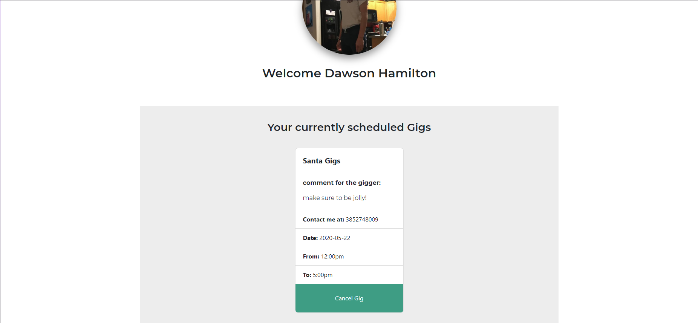

# Gigit

Full-stack application that gives you a place to schedule gigs for your entertainment needs. 

## [Try it yourself!](https://www.letsgigit.events)

### Home Page



### Welcome Page



### Gigs Page



### Form Page



### Profile Page



## Getting Started

These instructions will get you a copy of the project up and running on your local machine for 
development and testing purposes. They will also give an overview of some of the app's functionality. 

### Prerequisites

you will need MongoDB installed if you want to run this applicaiton locally. For help installing MongoDB, visit
````
https://docs.mongodb.com/manual/installation/
````

Once installed, make sure the MongoDB daemon is running with the following command line command:
````
$ mongod
````

### Installing

Git clone the repository to your local machine:

HTTPS:
````
$ git clone https://github.com/dawson-hamilton/devDivas.git
````
SSH:
````
$ git clone git@github.com:dawson-hamilton/devDivas.git
````

To connect to your local Mongo database, you will need to add an .env file in the root of your 
clonned repository containing the following code:
````
MONGO_DB="mongodb://localhost/<you decide the name here>"
````

Naxt, cd into the repository you cloned and install the necessary dependencies by running:
````
$ npm i
````

You will then be able to start the app locally by running:
````
$ npm start
````

## Built With

* [CSS](https://developer.mozilla.org/en-US/docs/Web/CSS) - Front-End style library
* [JavaScript](https://developer.mozilla.org/en-US/docs/Web/javascript) - High level programming language
* [MongoDB](https://www.mongodb.com/) - NoSQL Database
* [Express.js](https://expressjs.com/) - Node.js framework
* [React.js](https://reactjs.org/) - MVC front-end framework 
* [Node.js](https://nodejs.org/en/) - JavaScript runtime
* [React-Bootstrap](https://react-bootstrap.github.io/getting-started/introduction/) - CSS framework
* [Auth0](https://auth0.com/) - Authentication platform
* [Google OAuth](https://developers.google.com/identity/protocols/oauth2) - Allows Auth0 to use social connection

## Authors

See the list of [contributors](https://github.com/dawson-hamilton/devDivas/graphs/contributors) who participated 
in this project along with individual commit history. 

## Planned updates

At the moment, this app is a minimum viable product. We hope to add pages that give the consumer the freedom to choose 
from a list of giggers in the type of gig chosen. We also want to give the option to give a review after 
the event has finished, so that you can tell other people about your experience. Expand the gig types so that customers have more to choose from. Lastly we would like to implement a "My gigs" page that allows the cunsumer to easily see all the gigs they have scheduled.
